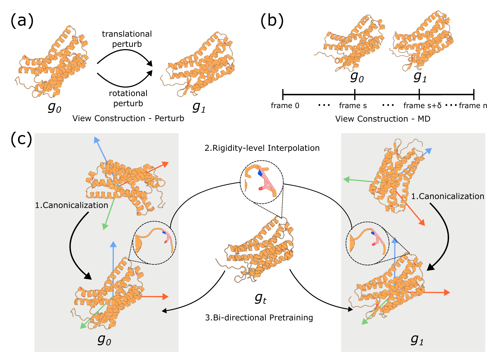

# RigidSSL: Rigidity-Aware Geometric Pretraining for Protein Design and Conformational Ensembles

<p align="center">
  <a href="https://iclr.cc/virtual/2026/poster/10008912"></a>
  <a href="https://arxiv.org/abs/2603.02406"></a>
  <a href="https://www.biorxiv.org/content/10.64898/2026.03.02.708991v2"></a>
  <a href="LICENSE"></a>
</p>

## Description

We introduce **RigidSSL**, a geometric pretraining framework that front-loads geometry learning prior to generative finetuning for protein structure generation. RigidSSL operates on residue-level rigid body representations in SE(3) and employs a two-phase pretraining strategy:

- **Phase I (RigidSSL-Perturb)** learns geometric priors from 432K structures from the AlphaFold Protein Structure Database with simulated perturbations.
- **Phase II (RigidSSL-MD)** refines these representations on 1.3K molecular dynamics trajectories to capture physically realistic transitions.

Underpinning both phases is a bi-directional, rigidity-aware flow matching objective that jointly optimizes translational and rotational dynamics. Empirically, RigidSSL variants improve designability by up to 43% while enhancing novelty and diversity in unconditional generation. RigidSSL-Perturb improves the success rate by 5.8% in zero-shot motif scaffolding, and RigidSSL-MD captures more biophysically realistic conformational ensembles in GPCR modeling.

<p align="center"></p>

## Installation

```bash
conda env create -f environment.yml
conda activate RigidSSL
```

## Data

We provide [processed datasets](https://huggingface.co/datasets/tonynzh/RigidSSL) on HuggingFace for both phases:
```bash
tar -xzf RigidSSL_Perturb_data.tar.gz
tar -xzf RigidSSL_MD_data.tar.gz
```

To process custom data from raw PDB files or MD trajectories, the dataset loaders in `datasets/` handle preprocessing automatically on first run:
```bash
python RigidSSL_Perturb.py --input_data_dir /path/to/pdb_files
python RigidSSL_MD.py --input_data_dir /path/to/md_trajectories
```

Configure data and output paths in `examples/path.sh` before training:
```bash
export PERTURB_DATA_DIR="/path/to/RigidSSL_Perturb_data"
export MD_DATA_DIR="/path/to/RigidSSL_MD_data"
```

## Training

[Pretrained checkpoints](https://huggingface.co/tonynzh/RigidSSL) are available on HuggingFace. To train from scratch:

### Phase I: RigidSSL-Perturb

```bash
cd examples
source path.sh
python RigidSSL_Perturb.py
```

### Phase II: RigidSSL-MD

```bash
cd examples
source path.sh
python RigidSSL_MD.py --pretrained_weights <PHASE_I_CHECKPOINT>
```


## Citation

If you find this work useful, please cite:

```bibtex
@inproceedings{
  ni2026rigidssl,
  title={Rigidity-Aware Geometric Pretraining for Protein Design and Conformational Ensembles},
  author={Zhanghan Ni and Yanjing Li and Zeju Qiu and Bernhard Sch{\"o}lkopf and Hongyu Guo and Weiyang Liu and Shengchao Liu},
  booktitle={International Conference on Learning Representations},
  year={2026},
  url={https://arxiv.org/abs/2603.02406}
}
```

## Acknowledgments

This codebase builds upon [OpenFold](https://github.com/aqlaboratory/openfold) and [FrameDiff](https://github.com/jasonkyuyim/se3_diffusion).
